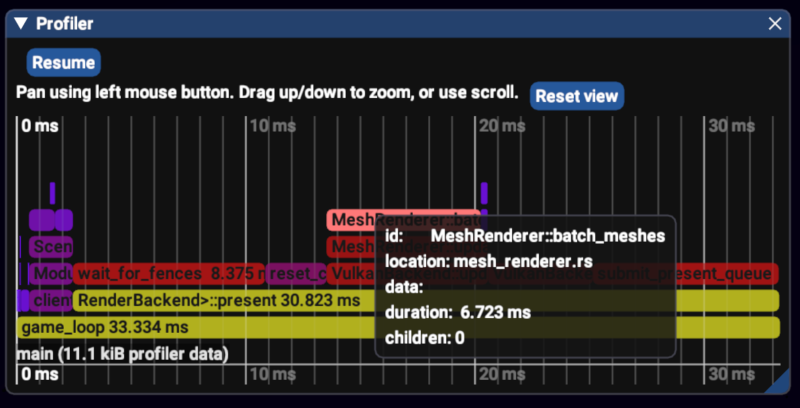

# 🐦 Puffin - The Friendly Little Profiler

[](https://github.com/EmbarkStudios/puffin/actions?workflow=CI)
[](https://crates.io/crates/puffin)
[](https://docs.rs/puffin)
[](CODE_OF_CONDUCT.md)
[](https://embark.dev)


Puffin is an instrumentation profiler written in Rust where you opt-in to profile parts of your code:

``` rust
fn my_function() {
    puffin::profile_function!():
    ...
    if ... {
        puffin::profile_scope_data!("load_image", image_name):
        ...
    }
}
```

The Puffin macros write data to a thread-local data stream. When the outermost scope of a thread is closed, the data stream is sent to a global profiler collector. The scopes are pretty light-weight, costing around 100-200 nanoseconds.

You have to turn on the profiler before it captures any data with a call to `puffin::set_scopes_on(true);`. When the profiler is off the profiler scope macros only has an overhead of 1-2 ns (and some stack space);

## UI

If you want to view a nice flamegraph of your profile data, you can use the crate `puffin-imgui` in this repo. It looks like this:



## Other

[Puffin photo by Richard Bartz](https://en.wikipedia.org/wiki/File:Papageitaucher_Fratercula_arctica.jpg)

## Contributing

We welcome community contributions to this project.

Please read our [Contributor Guide](CONTRIBUTING.md) for more information on how to get started.

## License

Licensed under either of

* Apache License, Version 2.0, ([LICENSE-APACHE](LICENSE-APACHE) or http://www.apache.org/licenses/LICENSE-2.0)
* MIT license ([LICENSE-MIT](LICENSE-MIT) or http://opensource.org/licenses/MIT)

at your option.

### Contribution

Unless you explicitly state otherwise, any contribution intentionally submitted for inclusion in the work by you, as defined in the Apache-2.0 license, shall be dual licensed as above, without any additional terms or conditions.
