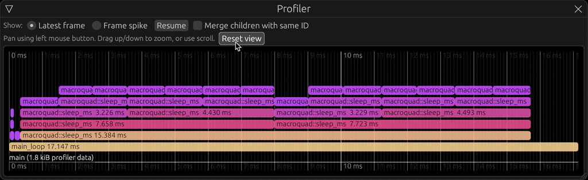

# Show [`puffin`](https://github.com/EmbarkStudios/puffin/) profiler flamegraph in-game using [`egui`](https://github.com/emilk/egui)

[](https://embark.dev)
[](https://discord.gg/dAuKfZS)
[](https://crates.io/crates/puffin_egui)
[](https://docs.rs/puffin_egui)

[`puffin`](https://github.com/EmbarkStudios/puffin/) is an instrumentation profiler where you opt-in to profile parts of your code:

``` rust
fn my_function() {
    puffin::profile_function!();
    if ... {
        puffin::profile_scope!("load_image", image_name);
        ...
    }
}
```

`puffin_egui` allows you to inspect the resulting profile data using [`egui`](https://github.com/emilk/egui) with only one line of code:

``` rust
puffin_egui::profiler_window(egui_ctx);
```



See the [`examples/`](examples/) folder for how to use it with [`eframe`](https://docs.rs/eframe).

To try it out, run `cargo run --release --example eframe`
